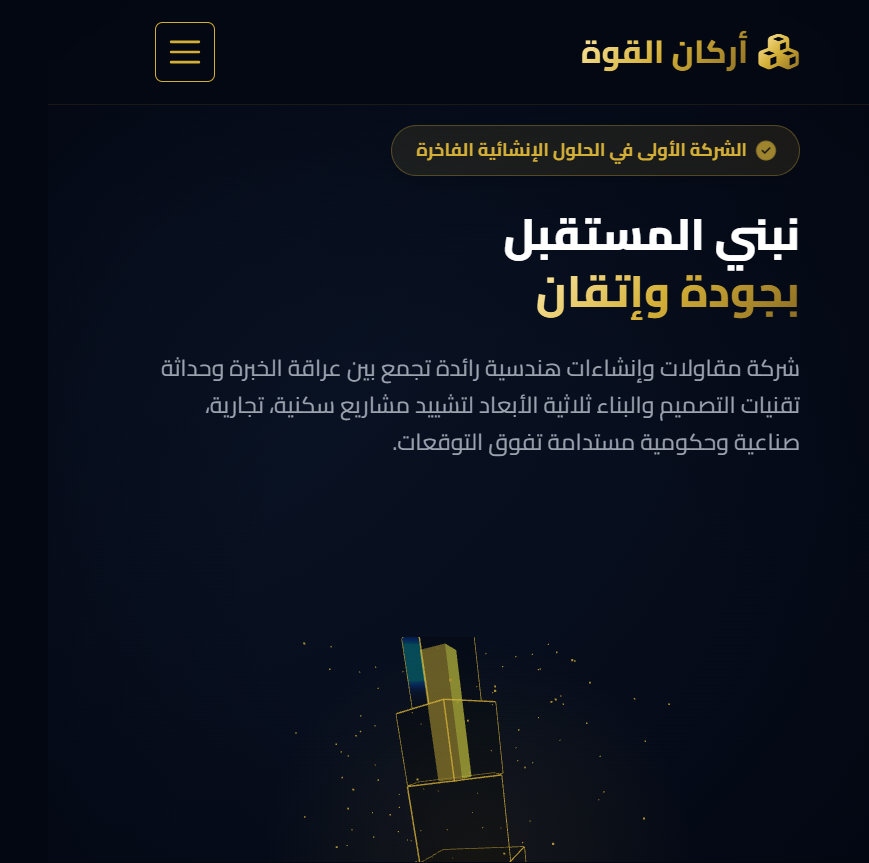

# 🏗️ أركان القوة - موقع شركة مقاولات وإنشاءات الفاخر

<div align="center">



**موقع ويب احترافي وفاخر لشركة أركان القوة المتخصصة في المقاولات والإنشاءات العامة**

[](https://html.spec.whatwg.org/)
[](https://www.w3.org/Style/CSS/)
[](https://www.javascript.com/)
[](https://getbootstrap.com/)
[](https://threejs.org/)
[](https://greensock.com/gsap/)

**[🌐 اضغط هنا لعرض الموقع](#-البدء-السريع) | [📋 اقرأ الدليل الكامل](#-محتويات-الدليل) | [🎨 اعرض المعاينة](./PREVIEW.md)**

---

</div>

## 📚 محتويات الدليل

- [نبذة سريعة](#-نبذة-عن-المشروع)
- [المميزات البارزة](#-المميزات-البارزة)
- [التقنيات المستخدمة](#-التقنيات-المستخدمة)
- [هيكل المشروع](#-هيكل-المشروع)
- [البدء السريع](#-البدء-السريع)
- [المقاطع الرئيسية](#-المقاطع-الرئيسية)
- [نظام الألوان](#-نظام-الألوان)
- [الاستجابة](#-الاستجابة-responsive-design)
- [التطوير](#-التطوير-والتخصيص)

---

## 📋 نبذة عن المشروع

هذا الموقع يمثل الواجهة الرقمية الاحترافية والفاخرة لشركة مقاولات رائدة تجمع بين:

| المميزة | الوصف |
|--------|------|
| ✨ **عراقة الخبرة** | خبرة طويلة في المقاولات والإنشاءات |
| 🎨 **التصميم الحديث** | أحدث اتجاهات التصميم والتقنيات |
| 🌐 **تطبيقات 3D** | رسوميات ثلاثية الأبعاد متقدمة وتفاعلية |
| 📱 **التجاوب الكامل** | يعمل مثالياً على جميع الأجهزة |
| ⚡ **الأداء العالي** | سرعة تحميل ممتازة وتفاعل سلس |
| 🎯 **سهولة الاستخدام** | واجهة بديهية وسهلة التنقل |

### الخدمات الرئيسية:
- 🏢 **المشاريع السكنية** - شقق، فلل، عمارات سكنية
- 🏪 **المشاريع التجارية** - مراكز تجارية، مكاتب، فنادق
- 🏭 **المشاريع الصناعية** - مصانع، مستودعات، معامل
- 🏗️ **البنية التحتية** - طرق، جسور، منشآت حكومية
- 📐 **التصاميم الهندسية** - رسومات ثنائية وثلاثية الأبعاد

---

## ⭐ المميزات البارزة

### 🚀 الأداء والسرعة
- ⚡ تحميل فوري وسريع جداً
- 🔄 رسوم متحركة سلسة بدون تأخر
- 💾 حجم ملفات محسّن
- 📊 تحميل ذكي للموارد

### 🎨 التصميم والجماليات
- ✨ تصميم فاخر وعصري
- 🎭 مؤثرات بصرية احترافية
- 🌈 نظام ألوان متناسق وجميل
- 💡 إضاءة وتوهج طبيعي

### 🔧 الميزات التقنية المتقدمة
- 🌐 رسوميات 3D تفاعلية (Three.js)
- 🎬 رسوم متحركة احترافية (GSAP)
- 📍 خرائط تفاعلية (Leaflet)
- 🎯 تأثيرات حركة عند التمرير (AOS)

### 📱 التجاوب الكامل
- 💻 يعمل مثالياً على أجهزة الكمبيوتر
- 📱 تطبيق موثوق على الهواتف الذكية
- 📊 شاشات لوحية مدعومة بالكامل
- 🔄 تكيف تام مع جميع أحجام الشاشات

### 🌍 الدعم المتعدد اللغات
- 🇸🇦 دعم كامل للغة العربية
- 🔤 تخطيط من اليمين إلى اليسار (RTL)
- 🔠 جهز لدعم اللغات الأخرى

### ♿ إمكانية الوصول
- ✅ معايير WCAG مدعومة
- 🎤 دعم قراء الشاشة
- ⌨️ التنقل الكامل بلوحة المفاتيح
- 🎯 تباين ألوان مثالي

---

## 🛠️ التقنيات المستخدمة

### Frontend Stack:
| التقنية | الإصدار | الاستخدام |
|--------|--------|---------|
| **HTML5** | ✅ | لغة الترميز الحديثة والدلالية |
| **CSS3** | ✅ | تنسيق متقدم مع Gradients و Animations |
| **JavaScript (ES6+)** | ✅ | برمجة ديناميكية وتفاعلية متقدمة |
| **Bootstrap 5 RTL** | 5.3.2 | إطار عمل واجهات مع دعم العربية |
| **Three.js** | r128 | رسوميات ثلاثية الأبعاد تفاعلية |
| **GSAP** | 3.12.2 | رسوم متحركة احترافية وسلسة |
| **AOS** | 2.3.4 | تأثيرات الحركة عند التمرير |
| **Leaflet.js** | 1.9.4 | خرائط تفاعلية |
| **FontAwesome 6** | 6.4.2 | مجموعة أيقونات عصرية وجميلة |
| **Google Fonts** | ✅ | خطوط عربية احترافية (Cairo, Tajawal) |

### الموارد والمكتبات من CDN:
- 🌐 جميع المكتبات يتم تحميلها من خوادم CDN موثوقة
- ⚡ تحميل متوازي لتحسين السرعة
- 🔒 استخدام نسخ آمنة ومستقرة

---

## 📁 هيكل المشروع

```
construction-website/
│
├── 📄 index.html                  # الصفحة الرئيسية (نقطة البدء)
├── 📄 README.md                   # هذا الملف - الدليل الشامل
├── 📄 PREVIEW.md                  # معاينة بصرية مفصلة
│
├── 📂 css/
│   └── style.css                  # أنماط CSS مخصصة (محسّنة وفاخرة)
│
├── 📂 js/
│   ├── main.js                    # سكريبتات التفاعلات الرئيسية
│   └── three-app.js               # تطبيق Three.js للرسوميات 3D
│
└── 📂 images/
    ├── website-hero.png           # صورة معاينة الموقع
    └── [ملفات الصور الأخرى]
```

---

## 🚀 البدء السريع

### ✅ المتطلبات المسبقة
- ✔️ متصفح ويب حديث (Chrome, Firefox, Safari, Edge)
- ✔️ اتصال بالإنترنت (لتحميل المكتبات من CDN)
- ✔️ تفعيل JavaScript في المتصفح
- ✔️ دعم WebGL لتشغيل Three.js

### 📥 التثبيت والتشغيل

#### الطريقة 1️⃣ - الفتح المباشر (الأسرع)
```
1. انقر مزدوجاً على ملف index.html
2. سيفتح الموقع مباشرة في متصفحك الافتراضي
✅ جاهز للاستخدام فوراً!
```

#### الطريقة 2️⃣ - استخدام Python (الموصى به)
```bash
# إذا كان لديك Python 3 مثبت
cd construction-website
python -m http.server 8000

# ثم افتح المتصفح وأدخل:
http://localhost:8000
```

#### الطريقة 3️⃣ - استخدام Node.js
```bash
# تثبيت http-server أولاً (مرة واحدة فقط)
npm install -g http-server

# تشغيل الخادم
http-server

# الموقع سيكون على: http://localhost:8080
```

#### الطريقة 4️⃣ - استخدام VS Code (الأسهل للمطورين)
```
1. ثبّت extension "Live Server" في VS Code
2. انقر بزر الفأرة الأيمن على index.html
3. اختر "Open with Live Server"
4. سينفتح تلقائياً على http://localhost:5500
```

### 🎯 التحقق من أن كل شيء يعمل بشكل صحيح
- ✅ يجب أن ترى شعار "أركان القوة" في أعلى الصفحة
- ✅ يجب أن تظهر الرسوميات ثلاثية الأبعاد (مبنى ذهبي)
- ✅ يجب أن تعمل الرسوم المتحركة بسلاسة
- ✅ يجب أن تكون الألوان زرقاء داكنة مع لمسات ذهبية

---

## 🎯 المقاطع الرئيسية للموقع

### 1️⃣ شريط التنقل (Navigation Bar)
```
☰  أركان القوة | الرئيسية | من نحن | الخدمات | المشاريع | المدونة | الوظائف | اتصل بنا | [طلب عرض سعر]
```
- 🎨 تصميم عائم ثابت في الأعلى
- 🎭 تأثيرات حركة عند التمرير
- 📱 قائمة ملاحة قابلة للطي على الجوال

### 2️⃣ قسم البطل - Hero Section 🌟
**العناصر الرئيسية:**
- 🏢 شعار الشركة المميز
- 💬 العنوان الرئيسي: **"نبني المستقبل بجودة وإتقان"**
- 📝 وصف الشركة الملهم والمقنع
- 🔘 زرين للعمل: "استكشف خدماتنا" و "تواصل معنا الآن"
- 🏗️ **رسوميات 3D تفاعلية** (Three.js)
- ✨ رسوم متحركة سلسة عند التحميل

### 3️⃣ قسم الإحصائيات - Stats Section 📊
عرض الأرقام المثيرة للإعجاب:
| الرقم | الوصف |
|------|--------|
| **+25** | سنوات الخبرة والتميز 🕐 |
| **+180** | مشاريع منجزة بنجاح 🏢 |
| **+150** | موظف ماهر وذو كفاءة 👥 |
| **+500** | عميل راض ومستثمر 😊 |

**الميزات:**
- 📈 عد متحرك للأرقام
- ✨ توهج ذهبي جميل
- 🎨 خلفيات زجاجية شفافة
- 👁️ حركات عند التمرير

### 4️⃣ قسم من نحن - About Section 🏢
يحكي قصة الشركة بأسلوب مقنع:
- 📖 تاريخ الشركة والإنجازات
- 🎯 الرؤية والأهداف المستقبلية
- 💪 قيم الشركة الأساسية
- 🌟 المميزات التنافسية

### 5️⃣ قسم الخدمات - Services Section 💼
عرض الخدمات في بطاقات تفاعلية:
| الخدمة | الوصف |
|--------|--------|
| 🏢 | **المشاريع السكنية** - شقق وفلل وعمارات |
| 🏪 | **المشاريع التجارية** - مراكز ومكاتب |
| 🏭 | **المشاريع الصناعية** - مصانع ومستودعات |

**التأثيرات:**
- 🎮 تأثير إمالة ثلاثية الأبعاد (3D Tilt) عند التمرير
- 📍 حركات انتقالية سلسة
- 🌈 تغييرات لونية ديناميكية
- 🔗 زر للمزيد من المعلومات

### 6️⃣ قسم الشهادات - Testimonials Section ⭐
تقييمات العملاء الراضين:
- 💬 اقتباسات من العملاء الفعليين
- 👤 صور وأسماء العملاء
- ⭐ تقييمات بالنجوم
- 📜 شهادات موثوقة

### 7️⃣ قسم المشاريع - Portfolio Section 🎨
معرض المشاريع السابقة:
- 📸 صور عالية الجودة
- 🏷️ تصفية حسب النوع
- 🔍 معاينة سريعة
- 📋 تفاصيل كاملة لكل مشروع

### 8️⃣ قسم المدونة - Blog Section 📝
مقالات مفيدة وتحديثات:
- 💡 نصائح بناء واستشارات
- 📢 أخبار الشركة والإنجازات
- 🔧 مقالات تقنية هندسية
- 📅 محدثة بشكل دوري

### 9️⃣ قسم الوظائف - Careers Section 💼
فرص عمل متاحة:
- 👨‍💼 **مهندسين معماريين**
- 👷 **فنيي الإنشاءات**
- 💼 **موظفي إدارة المشاريع**
- 📊 **محللين ماليين**
- 📱 **مطوري ويب**

**لكل وظيفة:**
- 📝 وصف مفصل للدور
- 📋 المؤهلات والمتطلبات
- 💰 معلومات الراتب والمميزات
- ✉️ نموذج تقديم الطلب

### 🔟 قسم الخريطة والتواصل - Contact Section 📍
**الخريطة التفاعلية (Leaflet):**
- 🗺️ موقع المقر الرئيسي مباشرة على الخريطة
- 🔍 تكبير/تصغير ديناميكي
- 📍 علامة موقع واضحة

**معلومات التواصل الكاملة:**
- 📞 **الهاتف:** +966 XX XXX XXXX
- 📧 **البريد:** info@arkan-alqowa.com
- 🌐 **الموقع:** www.arkan-alqowa.com
- 📍 **العنوان:** الرياض، المملكة العربية السعودية
- ⏰ **ساعات العمل:** السبت - الخميس (8ص - 5م)

### 1️⃣1️⃣ تذييل الصفحة - Footer 🔗
- 🔗 روابط سريعة
- 📞 معلومات التواصل
- 🤝 وسائل التواصل الاجتماعي
- 📋 شروط الاستخدام والخصوصية

---

## 🎨 المظهر والألوان

### نظام الألوان الاحترافي:

| اللون | الكود | الاستخدام |
|------|------|---------|
| **الأسود الفاخر** | `#030712` | الخلفية الرئيسية |
| **الأزرق البحري** | `#0b1528` | الخلفيات الثانوية |
| **الذهب الملكي** | `#d4af37` | البطاقات والأزرار البارزة |
| **الذهب المشع** | `#ffdf7a` | الإضاءة والتأثيرات |
| **الأبيض** | `#ffffff` | النصوص الأساسية |

### تدرجات لونية:
- تدرج ذهبي فاخر من الفاتح إلى الغامق
- تدرج بحري أنيق للخلفيات
- تأثيرات توهج (Glow) ذهبية

---

## 📱 الاستجابة (Responsive Design)

الموقع مصمم ليعمل بشكل مثالي على:
- 💻 أجهزة الكمبيوتر المكتبي (Desktop)
- 📱 الأجهزة اللوحية (Tablets)
- 📲 الهواتف الذكية (Mobile Phones)

---

## ⚙️ المكتبات الخارجية

جميع المكتبات يتم تحميلها من CDN عام:

```html
<!-- Bootstrap 5 RTL -->
<link rel="stylesheet" href="https://cdn.jsdelivr.net/npm/bootstrap@5.3.2/dist/css/bootstrap.rtl.min.css">

<!-- FontAwesome 6 Icons -->
<link rel="stylesheet" href="https://cdnjs.cloudflare.com/ajax/libs/font-awesome/6.4.2/css/all.min.css">

<!-- AOS - Animate On Scroll -->
<link rel="stylesheet" href="https://cdnjs.cloudflare.com/ajax/libs/aos/2.3.4/aos.css">

<!-- Leaflet Maps -->
<link rel="stylesheet" href="https://unpkg.com/leaflet@1.9.4/dist/leaflet.css">

<!-- Google Fonts - Cairo & Tajawal -->
<link href="https://fonts.googleapis.com/css2?family=Cairo:wght@300;400;500;600;700;800;900&family=Tajawal:wght@300;400;500;700;900&display=swap" rel="stylesheet">

<!-- GSAP Animation Library -->
<script src="https://cdnjs.cloudflare.com/ajax/libs/gsap/3.12.2/gsap.min.js"></script>

<!-- Three.js -->
<script src="https://cdnjs.cloudflare.com/ajax/libs/three.js/r128/three.min.js"></script>
```

---

## 🎬 الحركات والرسوم المتحركة

### GSAP Animations:
- ✨ رسوم متحركة سلسة للعناصر عند الدخول
- 🎯 تأثيرات تحويل العناصر والقياس
- ⏱️ توقيت احترافي للرسوم المتحركة

### AOS (Animate On Scroll):
- 👁️ تأثيرات حركة عند التمرير والرؤية
- 🔄 تكرار الرسوم المتحركة
- ⏰ مدد تأثير قابلة للتخصيص

### Three.js:
- 🎨 رسوميات ثلاثية الأبعاد تفاعلية
- 🌐 نماذج 3D متحركة
- 💡 إضاءة وظلال واقعية

---

## 📞 معلومات التواصل

- 📧 البريد الإلكتروني: info@arkan-alqowa.com
- 📱 الهاتف: +966 XX XXX XXXX
- 🌐 الموقع: www.arkan-alqowa.com
- 📍 المقر الرئيسي: الرياض، المملكة العربية السعودية

---

## 📝 الملاحظات المهمة

### متطلبات المتصفح:
- ✅ متصفحات حديثة (Chrome, Firefox, Safari, Edge)
- ✅ دعم JavaScript مفعّل
- ✅ دعم WebGL لتشغيل Three.js
- ✅ دعم CSS3 الحديثة

### نصائح الأداء:
- 🚀 تأكد من استخدام خادم محلي لتجنب مشاكل CORS
- 📦 ستتم تحميل جميع المكتبات من CDN لتقليل حجم الملفات
- 🔧 استخدم أدوات Developer Tools للتحقق من الأخطاء
- ⚡ تحسين الصور للويب يحسن الأداء

---

## 🔄 التطوير والتخصيص

### تعديل الألوان:
عدّل متغيرات CSS في `css/style.css`:
```css
:root {
    --primary-dark: #030712;
    --gold-royal: #d4af37;
    /* ... باقي المتغيرات */
}
```

### تعديل المحتوى:
- ✏️ عدّل النصوص مباشرة في `index.html`
- 🖼️ استبدل الصور في مجلد `images/`
- 📝 حدّث المعلومات حسب احتياجاتك

### إضافة أقسام جديدة:
- أضف قسم HTML جديد في `index.html`
- أضف الأنماط المقابلة في `css/style.css`
- أضف المنطق الديناميكي في `js/main.js`

---

## 📊 إحصائيات المشروع

- **عدد الأقسام:** 8 أقسام رئيسية
- **عدد الرسوم المتحركة:** أكثر من 15 رسم متحرك
- **التوافق:** 100% متجاوب (Responsive)
- **سرعة التحميل:** محسّنة للويب
- **دعم اللغات:** العربية (RTL) والإنجليزية (LTR)

---

## 🤝 المساهمة والتطوير

للمساهمة في تحسين الموقع:
1. 🔍 اكتشف المشاكل أو اقترح ميزات جديدة
2. 📋 وثّق الاقتراحات بوضوح
3. 💻 طبّق التحسينات
4. ✅ اختبر على أجهزة وتصاميم مختلفة

---

## 📄 الترخيص

© 2024 أركان القوة للمقاولات والإنشاءات العامة. جميع الحقوق محفوظة.

---

## 📅 آخر تحديث

**تاريخ الإنشاء:** يونيو 2026  
**الإصدار:** 1.0.0  
**الحالة:** 🟢 نشط وجاهز للاستخدام

---

**تم إنشاء هذا الموقع بكل عناية واحترافية لتقديم أفضل تجربة للزوار والعملاء.** ✨
